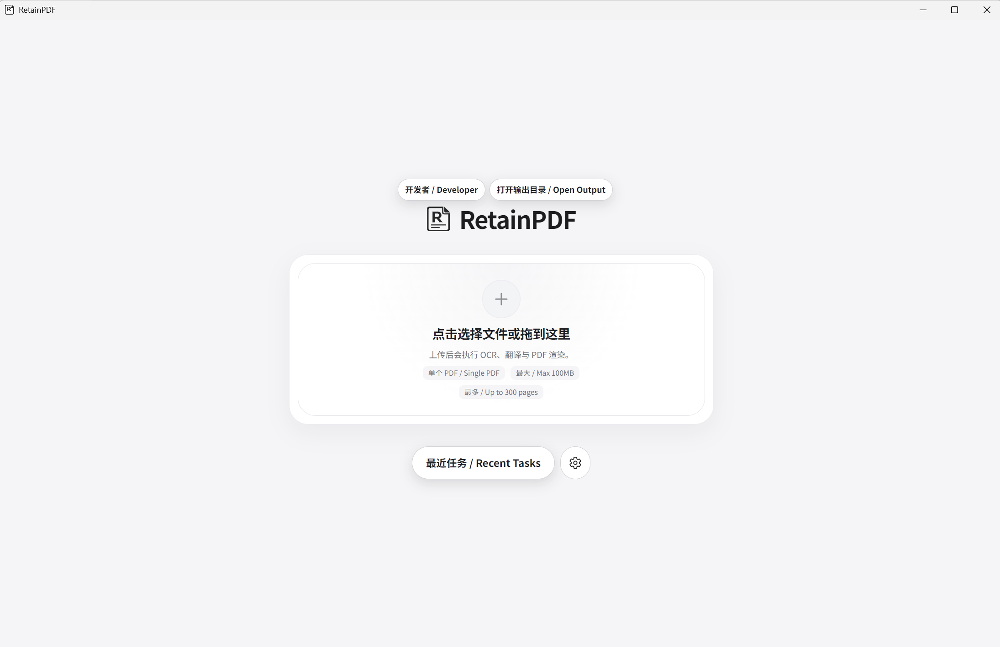

# RetainPDF

**PDF 智能翻译工具 · 专为海外工程现场设计**  
**Intelligent PDF Translation · Built for Overseas Engineering Teams**

> 基于 [wxyhgk/retain-pdf](https://github.com/wxyhgk/retain-pdf) 二次开发  
> Forked from [wxyhgk/retain-pdf](https://github.com/wxyhgk/retain-pdf) with significant enhancements

---

## 相比原版的核心改进 / Key Improvements over Original

| 项目 | 原版 | 本版 v5.2.7 |
|------|------|------------|
| OCR 引擎 | PaddleOCR | MinerU云端 + PaddleOCR + Docling 三引擎自由切换 |
| 本地引擎 | 无 | Docling 本地引擎（含复杂表格离线处理） |
| 表格翻译 | 无法翻译 / 排版严重错位 | 支持单元格级文字提取、独立分发翻译与精确回填 |
| 翻译方向 | 英译中 | 四方向：英↔中、英→斯瓦希里语、斯语→中（支持斯语自动检测并一键翻译） |
| 东非现场适配 | 通用设计 | 专为坦桑尼亚等东非弱网、多语种工程现场深度优化 |
| 缓存与速度 | 无本地缓存 | 独创 PDF MD5 本地缓存，二次翻译 0.07 秒秒级命中，告别弱网等待 |
| 字体环境 | 依赖系统字体（易缺失报错） | 静态打包思源黑体（Regular/Bold），跨平台及断网渲染稳定可靠 |
| 双语界面 | 中文界面 | 中英双语界面，国际团队均可使用 |
| 白底遮盖 | 标准渲染 | 动态 outset 精确遮盖，还原更干净 |
| 强制 OCR | 混合模式 | 所有 PDF 强制走 OCR，扫描件无遗漏 |
| 安装包 | 标准 | Windows 231MB / macOS 283MB |

---

## 下载安装 / Download & Install

前往 [Releases 页面](https://github.com/he55180/retain-pdf/releases) 下载最新版本 v5.2.7：

```
Windows:  RetainPDF-Windows-5.2.7-Setup.exe   (231 MB)
macOS:    RetainPDF-Mac-5.2.7.dmg             (283 MB)
```

双击安装，按提示完成即可。无需安装 Python、Node.js 等任何依赖。

---

## 运行模式 / Running Modes

### 完整模式（推荐，需要GPU）
- NVIDIA显卡 4GB显存以上
- pip install -r requirements-full.txt
- 表格翻译、扫描件处理全功能可用

### 基础模式（无GPU也可用）
- pip install -r requirements-base.txt  
- 使用MinerU云端OCR
- 普通文字翻译正常，复杂表格效果有限

## 必须配置 / Required Configurations
- DeepSeek API Key（翻译核心）
- MinerU Token（基础模式必须）

---



---

## 快速开始 / Quick Start

### 第一步：配置 API 凭证

安装后首次启动，进入 **设置 → API Settings**，填入以下凭证：

| 凭证 | 获取方式 | 必填 |
|------|---------|------|
| MinerU Token | 登录 [mineru.net](https://mineru.net) → API 管理 → 创建 Token | MinerU 模式必填 |
| DeepSeek API Key | 登录 [platform.deepseek.com](https://platform.deepseek.com) → API Keys | 必填 |
| PaddleOCR Token | 登录 [aistudio.baidu.com](https://aistudio.baidu.com) → 访问令牌 | PaddleOCR 模式必填 |

### 第二步：选择翻译方向

进入 **设置 → Task Options**，选择翻译方向：

- `EN → 中文 (Chinese)` — 英文文档翻译为中文（**默认，最常用**）
- `中文 → EN (English)` — 中文文档翻译为英文
- `EN → Kiswahili` — 英文翻译为斯瓦希里语
- `Kiswahili → 中文 (Chinese)` — 斯瓦希里语翻译为中文

### 第三步：翻译 PDF

1. 点击上传区，选择 PDF 文件（最大 100MB，建议单次不超过 10 页）
2. 点击 **全书翻译** 或 **分页翻译**
3. 等待完成，下载输出文件

> 单文件限制：最大 100MB，最多 300 页

---

## GUI 启动器 / GUI Launcher

本项目内置 tkinter 图形启动器（`RetainPDF-GUI/launcher.py`），无需命令行操作：

- **拖拽上传**：直接将 PDF 文件拖入窗口即可开始翻译
- **进度监控**：实时显示 OCR 识别进度和翻译状态
- **后端调用**：自动连接 Rust API 后端，编排 OCR / 翻译 / 渲染管线

**使用方法：** 双击 `RetainPDF-GUI/launcher.py` 启动 GUI 窗口，拖入 PDF 文件即可。

---

## 引擎选择建议 / Engine Selection Guide

### 三引擎定位说明

| 引擎 | 运行方式 | 核心优势 | 适用场景 |
|------|---------|---------|---------|
| **Docling 本地** | 完全离线 | 单元格级表格识别 | MoM会议纪要、ESHS月报、含表格合同及技术文件 |
| **PaddleOCR 本地** | 完全离线 | 高清扫描件提取 | 纯扫描件函件、图片密集型PDF文档 |
| **MinerU 云端** | 需联网 | 转换速度快 | 普通排版的纯文字文档、日常报告 |

### 按文件类型推荐

| 文件类型 | 推荐引擎 | 说明 |
|---------|---------|------|
| MoM 会议纪要 | Docling 本地 | 多列窄表格结构保留最佳 |
| ESHS 月报 | Docling 本地 | 含混合表格，本地离线稳定 |
| 合同 / 技术文件（含表格） | Docling 本地 | 单元格级精准回填 |
| 纯扫描件函件 | PaddleOCR 本地 | 高清图像提取，离线可用 |
| 图片密集型 PDF | PaddleOCR 本地 | 图片式页面识别率更高 |
| 普通文字文档 / 日常报告 | MinerU 云端 | 速度最快，开箱即用 |

**切换方法：** 设置 → Task Options → OCR Engine

---

## 推荐翻译提示词 / Recommended Translation Prompts

### 工程合同（英译中）

```
你是专业的工程合同翻译专家，请将以下英文内容翻译成简体中文。
要求：
1. 以下术语固定翻译，不得意译：
   - Contractor → 承包方
   - Employer → 业主方
   - Force Majeure → 不可抗力
   - Environmental Impact Assessment → 环境影响评估（EIA）
   - Environmental Management Plan → 环境管理计划（EMP）
   - Tanzania Shillings (TZS) → 坦桑尼亚先令
2. 保留原文中的合同编号、人名、地名不翻译
3. 保留原文排版结构，包括编号、缩进
4. 法律条款翻译力求准确，不得随意简化
```

### 工程文件（中译英）

```
You are a professional engineering document translator.
Translate the following Chinese content into formal English.
Requirements:
1. Use standard engineering and contractual terminology
2. Preserve all document numbers, names, and locations
3. Maintain the original formatting structure including numbering and indentation
4. Ensure accuracy for technical and legal terms
```

---

## 已知限制 / Known Limitations

- **安装路径**：请使用纯英文路径安装，中文路径可能导致程序启动异常或渲染错误。

- **大文件处理**：建议单次翻译不超过 20 页；超大文件（>20页）建议使用分页翻译功能，每批 5 页，避免超时或内存压力。本版引入本地 MD5 OCR 缓存，二次上传相同文件可秒级跳过 OCR 环节。

- **混排扫描件**：含大段英文引用的混排扫描件（如会议纪要附件），建议选用 PaddleOCR 引擎处理，识别率优于其他引擎。

- **表格翻译优化**：v5.2.7 版本已打通表格翻译，支持复杂表格的单元格级识别与精确回填，相比旧版本大幅提升了表格还原度。但在极复杂的跨行跨列合并单元格中，仍可能有细微偏移。

- **证件类扫描件**：彩色背景、手写内容混排的证件（如许可证、资质证书）OCR 识别率较低，不建议使用本工具处理。

- **MinerU 速度与弱网适配**：非洲网络环境下首次运行或无缓存时每页约需 30～60 秒。针对东非弱网现场，推荐启用本地 MD5 缓存，可完全免除重复网络提取开销。

- **MinerU Token 有效期**：90 天，到期后需登录 mineru.net 重新创建。

---

## 技术架构 / Technical Stack

```
RetainPDF v5.2.7
├── Electron Shell          # 跨平台桌面应用
├── Rust API (Axum)         # 后端任务编排
├── Python Pipeline         # OCR / 翻译 / 渲染
│   ├── Docling             # 本地离线引擎（表格 / 合同文件）
│   ├── MinerU              # 云端 OCR（默认，普通文档）
│   ├── PaddleOCR           # 本地离线 OCR（扫描件 / 图片类）
│   ├── DeepSeek            # LLM 翻译引擎
│   └── Typst               # PDF 排版渲染
└── Vanilla JS + Tailwind   # 前端界面
```

---

## 版本历史 / Changelog

| 版本 | 主要改动 |
|------|---------|
| v5.2.7 | 表格单元格坐标二次翻转修复；block_id硬编码导致的擦除块匹配丢失修复；TOC目录页中英叠压修复；signature误判整页漏译修复；跨页表格漏检文本挽救；页脚与正文重叠修复；签署页图像保护；字号自适应压缩；印章区域OCR误读保护；新增Docling本地引擎支持 |
| v5.2.6 | 清理死代码，架构精简 |
| v5.2.5 | 强制所有 PDF 走 OCR；完全删除区域过滤，正文翻译无遗漏 |
| v5.2.3 | 统一三份源码副本；测试全绿 20/20 |
| v5.2.2 | 修复中译英方向首页正文被误过滤问题 |
| v5.2.1 | 修复第二页正文被误过滤；补全 macOS 构建；优化上传区 UI |
| v5.1.2 | Cover rect 白底遮盖修复；outset 精确遮盖 |
| v5.1.0 | 回退至双云端引擎架构，安装包精简 |
| v4.3.x | 集成 Docling 离线引擎（后因体积/性能问题回退） |
| v4.1.3 | 首个发布版：MinerU 双引擎支持，绕过百度强制验证 |

---

## 开源协议 / License

本项目基于原项目 MIT 协议进行二次开发，同样遵循 [MIT License](LICENSE)。  
This project is a fork of [wxyhgk/retain-pdf](https://github.com/wxyhgk/retain-pdf), released under the MIT License.
